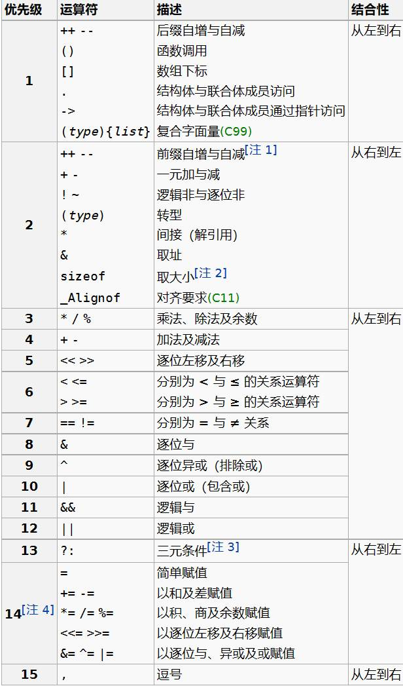
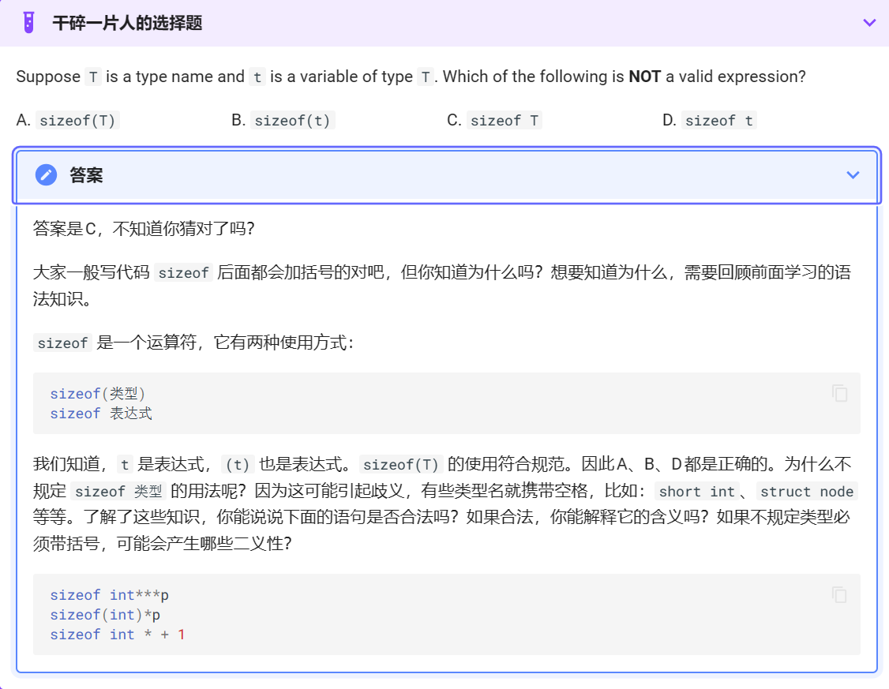

# C

## 一、运算符
* 优先级
        

        
  - **逗号**
        
    用来连接两个表达式，右边表达式作为它的结果，逗号的组合关系是从左到右，所以左边表达式先计算，右边表达式的值留下来作为逗号运算的结果
        
  - **&&与||**
        
    对于&&，左边是false时就不做右边
    对于||，左边是true就不做右边
        
  - **?:**
        
    count = (count>20)?count -10 : count+10;
    true则count -10 false则count+10
        
  - **switch**
    - 如果执行完分支中最后一条语句后，若后边无break，就是按顺序执行到下面的case，直到遇到一个break，或者switch结束为止
            
            ```c
            switch(type)
            {
            	case 1:
            	case 2:
            		printf("");
            		break;
            	case 3:
            		printf("");
            	case 4:
            		printf("");
            		break;
            	default:
            		printf("");
            		break;
            }
            	
            ```
            
- **sizheof**
    - 语法
            
        
            
    - sizeof是**静态运算符(**不是函数!)sizeof(a++)中++无任何作用

## 二、随机数
    
    ```c
    #include<stdio.h>
    #include<stdlib.h>
    #include<time.h>
    
    int main()
    {
    	srand(time(0));
    	int a = rand();
    
    	//a为随机数
    }

## 三、数组与指针
    - 二维数组的初始化
        
        ```c
        int a[][5] = { {0,1,2,3,4},{1,2,3,4,5},}
        ```
        
        - 列数必须给出，行数可以由编译器来数
        - 最后的逗号可以存在
        - 如果省略，表示补零
    - 从特定部位开始初始
        
        ```c
        int a[10] = {[0] = 2,[2] = 3,6};
        ```
        
        没有定位的数据接在前面的位置后面，其他位置的值补零
        
    - 数组变量是特殊的指针
        - 数组变量本身表达地址所以
            - `int a[10];int* p =a`//无需用&取地址
            - `a == &a[0]`  //每个数组单元需要取&
            - `p[0] == a[0]`
            - `*a = 25`
            - `int a[] == int* const a` 数组是const的指针，所以不能被赋值
    - 数组参数
        
        以下四种函数原型是等价的
        
        - int sum(int *ar,int n);
        - int sum(int *,int);
        - int sum(int ar[],int n);
        - int sum(int [],int);
        - int fun(int a[5]) 酱紫也可以运行
    - conts who及应用
        - int* const q = &i; // q is const
        *q = 26; 
        q++; //ERROR
        - const in *p = &i; 表示不能通过这个指针去修改那个变量
        *p = 26//ERROR
        i = 26;
        p = &j;
        - 综上，判断哪个被const了的标志是const在*的前边还是后边
        - **应用**:保护数组值
        因为把数组传入函数时传递的是地址，所以那个函数内部可以修改数组的值。
        为了保护数组不被函数破坏，可以设置参数为const
        int sum(const int a[],int length)
    - 指针类型的转换
        - void* 表示不知道指向什么东西的指针
        - 指针也可以转换类型
        - `int* *p = &i;void ** q = (void**)p`*  此时没有改变p所指变量的类型，而是让后人用不同眼光通过p看它所指的变量
            - 我不再当你是int啦，我认为你就是个void
    - 二级指针
        - char **a   a是一个指针，指向另一个指针
        - char a[][] ≠ char *a[]
            
            ```c
            char a[][]10 = {"Hello","World"};
            a[0] --> char [10]
            a[0]    [Hello\0]
            a[1]    [World\0]
            
            char *a[]
            a[] --> [] []内的东西指向外面某处[Hello\0]等
            ```
            
## 四、数据类型及自变量


    - *字节大小*
        - int ：4个字节
        - char：1个字节
        - double 8个字节
        - short 2个字节
        - 一个字节的数据大小范围为什么是-128~127
            - 一个字节是8位，最高位是符号位，最高位为0则是正数。最高位为1则是负数
            - 如果一个数是正数，最大数则为：01111111，转为十[进制](https://so.csdn.net/so/search?q=%E8%BF%9B%E5%88%B6&spm=1001.2101.3001.7020)为127，
            - **但是**：一个+0表示为：00000000，一个-0表示为：1000000，因为符号位不算在里面，所以就会有两个0，所以从一开始发明[二进制](https://so.csdn.net/so/search?q=%E4%BA%8C%E8%BF%9B%E5%88%B6&spm=1001.2101.3001.7020)的时候，就把-0规定为-128，如此二进制的补码就刚好在计算机中运作中吻合。（这是国内教材中的解释）
    - *整形*
        - 123表示十进制123
        - 0123是八进制表示方法 为83
        - 0x123是十六进制的表示方法，为291
    - *字符型*
        - 同时 在引号里有转义的效果，比如 '\n' '\t' 都代表一个字符，而 '\\' 才会表示一个 字符；
        - 再进一步， 后面可以接最多三个数字来使用八进制表示一个字节，且遇到 0-7 范围之外的数字会结束当前字节，比如 '\101' 也表示 'A'，而 '\08' 因为 8 超过了八进制范围，所以这是两个字符放到了一个单引号里，不是正确的用法，如果写成字符串，则 "\08" 表示两个字符；

## 五、结构类型
  - *枚举(不常用)*
    - 格式: enum 枚举类型名字{名字0,….名字n};
    - 大括号内是常量符号，类型为int,值依次从0到n
            
```
enum colors {red,yellow,green};
enum colors(red=1,yellow,green=5);
```
        
  - *结构*

```c
    struct
    {

    }
```

## 六、标识符与关键字
    
    - C语言的标识符由字母、数字、下划线组成，并且第一个字符必须是字母或下划线，不能是数字。在标识符中，字母的大小写是有区别的，例如BOOK与book是两个不同的标识符。C语言关键字不可以用做标识符
    
    - **关键字**
        
## 七、数据类型关键字
        
**A基本数据类型（5个）**
        
    - void：声明函数无返回值或无参数，声明无类型指针，显式丢弃运算结果
    - char：字符型类型数据，属于整型数据的一种
    - int：整型数据，通常为编译器指定的机器字长
    - float：单精度浮点型数据，属于浮点数据的一种
    - double：双精度浮点型数据，属于浮点数据的一种
        
**B类型修饰关键字（4个）**
        
    - short：修饰int，短整型数据，可省略被修饰的int。
    - long：修饰int，长整形数据，可省略被修饰的int。
    - signed：修饰整型数据，有符号数据类型
    - unsigned：修饰整型数据，无符号数据类型
        
**C复杂类型关键字（5个）**
        
    - struct：结构体声明
    - union：共用体声明
    - enum：枚举声明
    - typedef：声明类型别名
    - sizeof：得到特定类型或特定类型变量的大小
        
**D存储级别关键字（6个）**
        
    - auto：指定为自动变量，由编译器自动分配及释放。通常在栈上分配
    - static：指定为静态变量，分配在静态变量区，修饰函数时，指定函数作用域为文件内部
    - register：指定为寄存器变量，建议编译器将变量存储到寄存器中使用，也可以修饰函数形参，建议编译器通过寄存器而不是堆栈传递参数
    - extern：指定对应变量为外部变量，即在另外的目标文件中定义，可以认为是约定由另外文件声明的对象的一个“引用“
    - const：与volatile合称“cv特性”，指定变量不可被当前线程/进程改变（但有可能被系统或其他线程/进程改变）
    - volatile：与const合称“cv特性”，指定变量的值有可能会被系统或其他进程/线程改变，强制编译器每次从内存中取得该变量的值
        
## 八、流程控制关键字
        
        **A跳转结构（4个）**
        
        - return：用在函数体中，返回特定值（或者是void值，即不返回值）
        - continue：结束当前循环，开始下一轮循环
        - break：跳出当前循环或switch结构
        - goto：无条件跳转语句
        
        **B分支结构（5个）**
        
        - if：条件语句
        - else：条件语句否定分支（与if连用）
        - switch：开关语句（多重分支语句）
        - case：开关语句中的分支标记
        - default：开关语句中的“其他”分治，可选。
        
        **C循环结构（3个）**
        
        - for：for循环结构，for(1;2;3)4;的执行顺序为1->2->4->3->2...循环，其中2为循环条件
        - do：do循环结构，do 1 while(2);的执行顺序是1->2->1...循环，2为循环条件
        - while：while循环结构，while(1) 2;的执行顺序是1->2->1...循环，1为循环条件
        
        以上循环语句，当循环条件表达式为真则继续循环，为假则跳出循环。
        
- **字符串**
    - 输入和输出
        - putchar
        - getchar  返回类型为 int